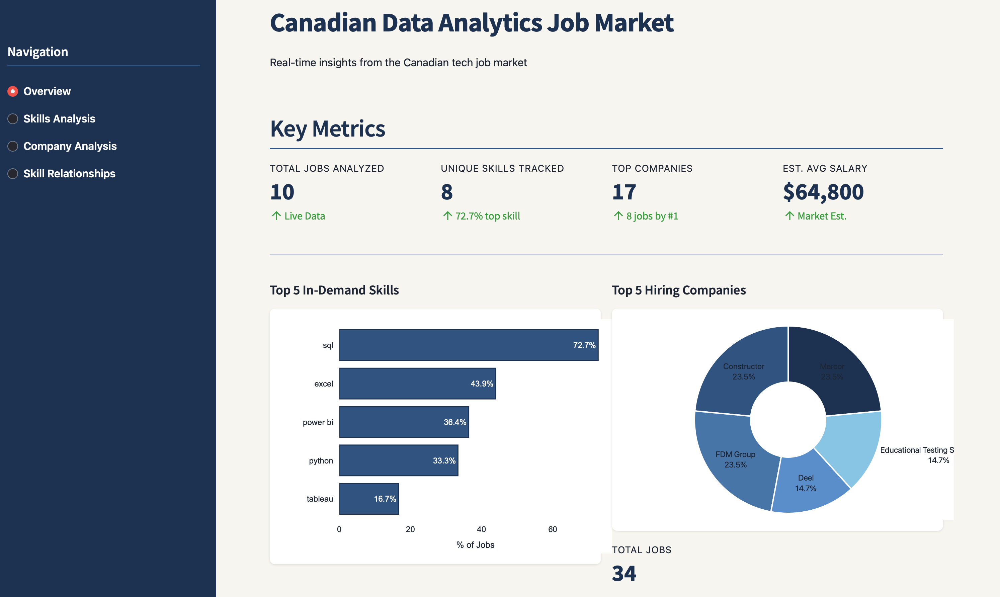
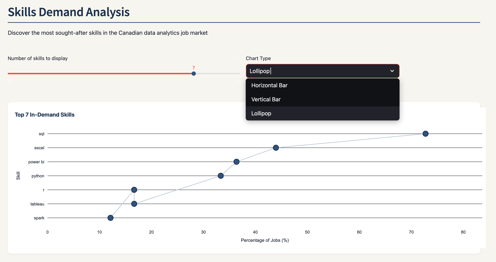
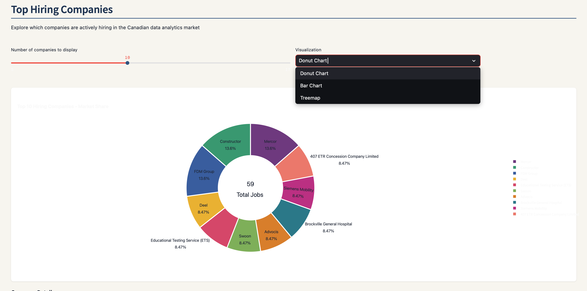
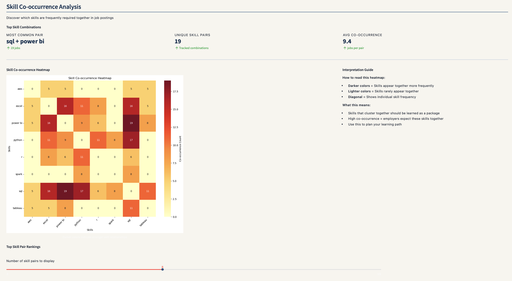

# Canadian Data Analytics Job Market - Analytics Pipeline

End-to-end data pipeline for analyzing the Canadian data analytics job market with real-time insights through an interactive Streamlit dashboard.

## Dashboard Screenshots

### Overview

Key metrics and market overview including top skills distribution and hiring trends.

### Skills Analysis

In-depth analysis of the most in-demand skills in the Canadian data analytics job market.

### Company Analysis

Top hiring companies and their market share in the data analytics sector.

### Skill Relationships

Heatmap showing which skills are commonly required together in job postings.

## Tech Stack

**Web Scraping:** Requests
**Data Processing:** Pandas, NumPy
**Database:** PostgreSQL 
**Automation:** Schedule
**Visualization:** Streamlit, Plotly, Matplotlib, Seaborn
